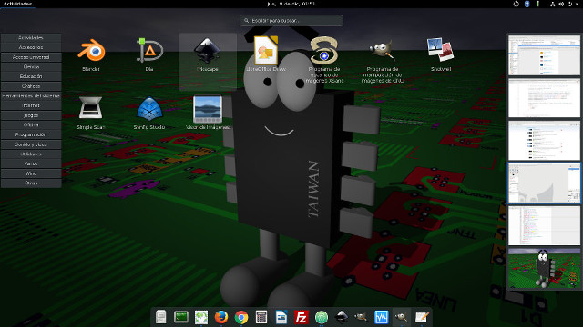

# ActivityAppLauncher #

A gnome shell extension that adds a category-based application launcher to the Activities view.

By default, the Activities view works exactly as usual (it shows the windows list and allows to find apps by typing), but when the user clicks on a category, a list with the applications in that category is shown.

Note: the dash has been moved to the bottom and converted in a dock thanks to ["Dash to dock"](https://extensions.gnome.org/extension/307/dash-to-dock/) extension, which is NOT part of activityAppLauncher.

IMPORTANT: requires "libgnome-menu-3-dev". It must be installed BEFORE trying to install this extension.

